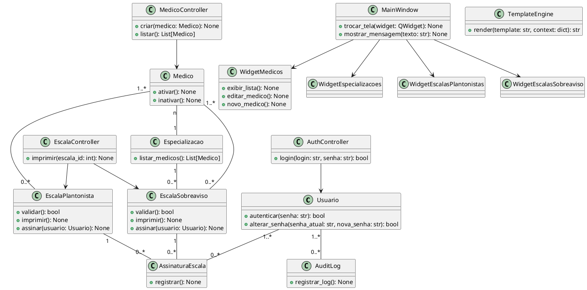

# Guia Rápido de Configuração – GEM

## 1. IDEs Recomendadas

- **PyCharm** (Community/Professional): Completo para Python.
- **VS Code** + Extensão Python: Leve, ótimo para PySide6 e notebooks.
- Outras: Visual Studio, Thonny, Spyder, Sublime Text.

## 2. Ambiente Virtual

Sempre use ambiente virtual para isolar dependências.

```sh
python -m venv .venv
# Ativação:
# Windows
.venv\Scripts\activate
# Linux/macOS
source .venv/bin/activate
```

## 3. Instalação de Dependências

- As dependências estão em `requirements.txt`.
- Edite conforme necessário.

**Exemplo de dependências principais:**

```
PySide6
qtawesome
SQLAlchemy
alembic
passlib
bcrypt
cryptography
pytest
pytest-qt
pytest-cov
pytest-benchmark
loguru
matplotlib
seaborn
pyqtgraph
pandas
black
isort
```

_(Adicione outras conforme necessidade.)_

**Instalar tudo:**

```sh
pip install -r requirements.txt
```

**Adicionar nova dependência:**

```sh
pip install flask  # exemplo
pip freeze > requirements.txt
```

> Dica: Fixe versões em produção para garantir estabilidade (ex: `PySide6==6.7.0`).

## 4. Estrutura de Pastas do Projeto

A estrutura do projeto segue o padrão recomendado por Pablo Dall'Oglio para aplicações Python desktop modulares e reutilizáveis:

```
Lib/
    Escala/
        Control/        # Conterá classes que interpretarão ações e gerenciarão o fluxo de controle
        Core/           # Conterá classes que serão responsáveis pela carga das demais classes da aplicação
        Database/       # Conterá classes responsáveis pela Persistência de Dados
        Log/            # Conterá classes de log
        Session/        # Conterá classes de manipulação de sessões
        Traits/         # Conterá traits que poderão ser reaproveitados em diferentes contextos
        Validations/    # Conterá classes de validação de dados
        Widgets/        # Cnterá componentes utilizados para a montagem de interfaces, como formulários e datagrids

App/
    Config/            # Conterá arquivos de configuração da aplicação, tais como de acesso às bases de dados
    Control/           # Conterá classes de controle da aplicação
    Database/          # Eventualmente, conterá base de dados, como aquelas em SQLite
    Images/            # Conterá imagens específicas da aplicação
    Model/             # Conterá as classes de modelo da aplicação
    Resources/         # Conterá recursos externos com fragmentos de arquivos  (csv, txt, html, etc) utilizados na montagem de interfaces
    Services/          # Conterá classes que formam serviços, como aqueles voltados para web services
    Templates/         # Conterá os templates que formarão o layout da aplicação
    tests/             # Conterá os Testes automatizados da aplicação

docs/                  # Documentação do projeto
main.py                # Script principal (front controller)
requirements.txt       # Dependências do projeto
README.md              # Guia rápido e instruções
```

### 4.1 Resumo das Responsabilidades

- **Lib/Escala/**: Biblioteca reutilizável, framework, núcleo, controladores, modelos, repositórios, traits, widgets e utilitários genéricos. Tudo que pode ser aproveitado em outros projetos.
- **App/**: Código específico desta aplicação: controladores, modelos, serviços, recursos, imagens, templates, configurações e testes.
- **main.py**: Ponto de entrada da aplicação, inicializa o ambiente, carrega o núcleo do framework e exibe a janela principal.
- **docs/**: Documentação técnica e de usuário.

### 4.2 Exemplo de Fluxo (Front Controller)

O arquivo `main.py` faz a inicialização da aplicação e exibe a janela principal. Para um front controller real, importe o controlador principal de `Lib/Escala/Control` ou de `App/Control`:

```python
from PySide6.QtWidgets import QApplication
from Lib.Escala.Control.controllers import FrontController  # Exemplo
import sys

def main():
    app = QApplication(sys.argv)
    window = FrontController()  # Substitua por seu front controller real
    window.show()
    sys.exit(app.exec())

if __name__ == "__main__":
    main()
```

Adapte o import conforme a implementação do seu controlador principal.

---

## 5. Logging Centralizado

O logger centralizado está em `Escala/utils/logger.py`. Importe e use em qualquer módulo:

```python
from Escala.utils.logger import get_logger
logger = get_logger(__name__)
```

Todos os logs vão para o console e para o arquivo `logs/gem_app.log`.

---

## Exemplo de Implementação do main.py

```python
import sys
from PySide6.QtWidgets import QApplication, QMainWindow
from gem.Escala.Core.class_loader import ClassLoader
from gem.Escala.Core.app_loader import AppLoader
from gem.utils.logger import get_logger

logger = get_logger(__name__)

def load_template(path='app/Templates/template.html'):
    """
    Lê um template HTML, se for necessário para relatórios ou interface híbrida.
    Não é usado diretamente na janela principal Qt, mas pode ser útil para futuras funções.
    """
    try:
        with open(path, encoding='utf-8') as f:
            return f.read()
    except Exception as e:
        logger.error(f"Falha ao carregar template: {e}")
        return "<h1>Erro ao carregar template</h1>"

class MainWindow(QMainWindow):
    def __init__(self):
        super().__init__()
        self.setWindowTitle("GEM - Gestão de Escala Médica")
        self.setGeometry(100, 100, 900, 600)
        # Futuramente: adicionar widgets, menus, status bar, etc.

def main():
    logger.info("Iniciando aplicação GEM (Front Controller)...")
    app = QApplication(sys.argv)
    window = MainWindow()
    window.show()
    try:
        ret = app.exec()
        logger.info("Aplicação encerrada normalmente.")
        sys.exit(ret)
    except Exception as e:
        logger.error(f"Erro fatal na aplicação: {e}", exc_info=True)
        sys.exit(1)

if __name__ == "__main__":
    main()
```

### Resumo do funcionamento

- Utiliza os loaders (`ClassLoader`, `AppLoader`), prontos para expansão futura.
- Inicia a aplicação com uma janela principal vazia, título e tamanho definidos.
- Adota logging centralizado para rastreamento de eventos e erros.
- Estrutura pronta para evoluir conforme o padrão de Pablo Dall’Oglio, com Front Controller e organização modular.

### Como utilizar

1. Certifique-se de que as dependências estão instaladas (`pip install -r requirements.txt`).
2. Execute a aplicação com:
   ```sh
   python main.py
   ```
3. O logger registrará eventos no console e no arquivo de log.
4. Expanda a classe `MainWindow` e os loaders conforme a necessidade do seu projeto.

---

## 6. Templates e Componentes de Interface

### Templates (Layout Visual)

- Os arquivos de template HTML, CSS, JS e imagens estão localizados em `app/Templates/`.
- O arquivo principal é `template.html`, podendo ser utilizado para relatórios ou visualização híbrida.
- O método `load_template` em `main.py` permite carregar templates HTML para uso futuro, como geração de relatórios ou visualização web.

### Componentes de Interface (Widgets)

- Componentes reutilizáveis de interface ficam em `Lib/Escala/Widgets/`, organizados por tipo (Form, Datagrid, Dialog, Container, etc).
- Esses widgets são classes Python que facilitam a montagem de formulários, tabelas, diálogos e outros elementos de interface, seguindo o padrão modular.

### Separação de Responsabilidades

- O layout visual (HTML/CSS/JS) é mantido separado dos componentes de interface Python.
- Isso permite flexibilidade para evoluir tanto a interface gráfica (Qt) quanto relatórios ou visualizações web, mantendo o código organizado e reutilizável.

---

## 7. Como usar o sistema de template para exibir telas da aplicação

O sistema de template do GEM permite separar o layout visual do conteúdo dinâmico das telas, facilitando a manutenção e a evolução da interface.

### Estrutura

- O arquivo `app/Templates/template.html` contém o layout base, com um container central:
  ```html
  <div id="content-area">{content}</div>
  ```
- O marcador `{content}` é substituído pelo Python pelo conteúdo HTML da tela desejada.
- O menu Qt (criado no Python) controla a navegação entre as telas.
- O componente `QWebEngineView` exibe o template, aplicando todo o CSS/JS.

### Como exibir o conteúdo das telas

1. **Defina o conteúdo HTML de cada tela**
   - No Python, crie strings HTML para cada tela (exemplo: `<h2>Cadastro de Médicos</h2>`, formulários, tabelas, etc).
   - No método `show_in_template` da classe `MainWindow`, associe cada item do menu ao HTML correspondente usando um dicionário:
     ```python
     content_map = {
         "medicos": "<h2>Cadastro e Gestão de Médicos</h2>",
         "escalas": "<h2>Cadastro e Gestão de Escalas</h2>",
         # ... outros itens ...
     }
     ```
2. **Atualize o conteúdo dinamicamente**
   - Ao clicar em um item do menu, o método `show_in_template` executa um JavaScript no template:
     ```python
     js = f"setContent(`{html_content}`);"
     self.browser.page().runJavaScript(js)
     ```
   - Isso troca apenas o conteúdo do container, sem recarregar a página inteira.

### Vantagens

- Separação total entre layout (HTML/CSS/JS) e lógica de navegação (Python/Qt).
- Facilidade para criar, modificar ou reaproveitar telas.
- Interface estilizada e responsiva, aproveitando todo o poder do template HTML.
- Navegação controlada pelo menu Qt, mantendo o padrão desktop e a arquitetura modular.

---

## Diagrama de Classes Inicial



---

## Explicação das Classes

### 1. Usuario

Representa um usuário do sistema (administrador, coordenador, diretor técnico, anestesista, usuário comum).

- `autenticar(senha: str): bool` — Verifica se a senha fornecida corresponde ao hash armazenado, permitindo o login.
- `alterar_senha(senha_atual: str, nova_senha: str): bool` — Permite ao usuário trocar sua senha mediante validação da senha atual.

### 2. Medico

Representa um médico cadastrado, que pode estar ativo ou inativo e ter uma especialização.

- `ativar(): None` — Ativa o médico na base.
- `inativar(): None` — Inativa o médico na base.

### 3. Especializacao

Representa uma área de especialização médica.

- `listar_medicos(): List[Medico]` — Retorna todos os médicos vinculados a essa especialização.

### 4. EscalaPlantonista

Representa uma escala de plantão (plantonistas), dividida por data e turno, com dois médicos por turno.

- `validar(): bool` — Valida regras de negócio para escala de plantonistas (ex: médicos não podem repetir turno no mesmo dia).
- `imprimir(): None` — Gera documento (PDF/HTML) da escala para impressão, incluindo assinaturas.
- `assinar(usuario: Usuario): None` — Registra assinatura na escala por um dos três papéis exigidos.

### 5. EscalaSobreaviso

Representa uma escala de sobreaviso, que pode ser semanal ou quinzenal, dependendo da especialidade.

- `validar(): bool` — Valida regras específicas de sobreaviso (ex: ortopedia é quinzenal, demais semanal).
- `imprimir(): None` — Gera documento da escala para impressão.
- `assinar(usuario: Usuario): None` — Registra assinatura na escala de sobreaviso.

### 6. AssinaturaEscala

Registra a assinatura de uma escala (plantonista ou sobreaviso) por um usuário, salvando papel, data e hora.

- `registrar(): None` — Salva a assinatura no banco, associando usuário, escala e papel (coordenador, diretor técnico, anestesista).

### 7. AuditLog

Mantém o registro de todas as operações sensíveis do sistema (auditoria).

- `registrar_log(): None` — Registra detalhes da operação (quem fez, quando, o quê mudou).

### 8. MainWindow

Janela principal da interface gráfica do sistema.

- `trocar_tela(widget: QWidget): None` — Troca o componente/tela exibido no centro da janela.
- `mostrar_mensagem(texto: str): None` — Exibe mensagens de aviso, erro ou sucesso ao usuário.

### 9. Widgets (WidgetMedicos, WidgetEspecializacoes, WidgetEscalasPlantonistas, WidgetEscalasSobreaviso)

Representam componentes/telas específicos da interface gráfica para cada módulo do sistema.

- `exibir_lista(): None` — Mostra a lista de médicos cadastrados.
- `editar_medico(): None` — Permite edição de dados de um médico.
- `novo_medico(): None` — Permite cadastro de novo médico.

### 10. TemplateEngine

Motor de template para gerar documentos HTML/PDF das escalas (usado na impressão).

- `render(template: str, context: dict): str` — Gera o HTML final de um documento a partir de um template e dados dinâmicos.

### 11. Controllers (AuthController, MedicoController, etc.)

Controladores que implementam a lógica de negócio, controlando fluxo de dados entre modelos e interface.

- `login(login: str, senha: str): bool` — Realiza autenticação do usuário.
- `criar(medico: Medico): None` — Cria novo médico.
- `listar(): List[Medico]` — Lista médicos cadastrados.
- `imprimir(escala_id: int): None` — Gera documento para impressão de escala.

---

## Relacionamentos

- **Usuario 1.._ ↔ 0.._ AuditLog:** Um usuário pode gerar muitos logs de auditoria.
- **Usuario 1.._ ↔ 0.._ AssinaturaEscala:** Um usuário pode assinar várias escalas.
- **Medico n ↔ 1 Especializacao:** Cada médico tem uma especialização, cada especialização pode ter vários médicos.
- **Medico 1.._ ↔ 0.._ EscalaPlantonista/EscalaSobreaviso:** Médicos podem estar em muitas escalas; cada escala tem 1 ou mais médicos.
- **Especializacao 1 ↔ 0..\* EscalaSobreaviso:** Uma especialização pode ter várias escalas de sobreaviso.
- **EscalaPlantonista/EscalaSobreaviso 1 ↔ 0..\* AssinaturaEscala:** Uma escala pode ter até 3 assinaturas (coordenador, diretor técnico, anestesista).
- **MainWindow → Widgets:** MainWindow controla e exibe os diferentes widgets/telas.
- **Controllers ↔ Models:** Cada controller manipula seu respectivo modelo, executando regras de negócio, validações e persistência.

---

## Resumo

- **Classes de modelo** representam os dados (usuário, médico, especialização, escala, assinatura, log).
- **Widgets** representam as telas/componentes visuais.
- **Controllers** tratam a lógica de negócio e orquestram operações.
- **TemplateEngine** gera os documentos para impressão, incluindo espaço para as três assinaturas obrigatórias.
- **Relacionamentos** garantem integridade, navegação e associação entre entidades do domínio.

# Modelo Relacional da Aplicação GEM

## Entidades

---

### **1. USUARIO**

- **id** (PK)
- nome
- login (unique)
- senha_hash
- perfil (`admin`, `coordenador`, `diretor_tecnico`, `anestesista`, `usuario`)
- status (ativo/inativo)

---

### **2. ESPECIALIZACAO**

- **id** (PK)
- nome (unique)

---

### **3. MEDICO**

- **id** (PK)
- nome
- nome_pj
- especializacao_id (FK → ESPECIALIZACAO.id)
- status (`ativo`/`inativo`)

---

### **4. ESCALA_PLANTONISTA**

- **id** (PK)
- data
- turno (`diurno`/`noturno`)
- medico_0_id (FK → MEDICO.id)
- medico_1_id (FK → MEDICO.id)

---

### **5. ESCALA_SOBREAVISO**

- **id** (PK)
- data_inicial
- data_final
- medico_id (FK → MEDICO.id)
- especializacao_id (FK → ESPECIALIZACAO.id)

---

### **6. ASSINATURA_ESCALA**

- **id** (PK)
- escala_id (FK → ESCALA_PLANTONISTA.id OU ESCALA_SOBREAVISO.id, dependendo do tipo)
- tipo_escala (`plantonista`/`sobreaviso`)
- usuario_id (FK → USUARIO.id)
- papel (`coordenador`, `diretor_tecnico`, `anestesista`)
- data_hora

---

### **7. AUDIT_LOG**

- **id** (PK)
- usuario_id (FK → USUARIO.id)
- modelo (nome da tabela afetada)
- operacao (`INSERT`, `UPDATE`, `DELETE`)
- data_hora
- dados_anteriores (JSON)
- dados_novos (JSON)

---

## RELACIONAMENTOS

### **Associações**

- **USUARIO** 1 — \* **AUDIT_LOG**Um usuário pode gerar muitos logs de auditoria.
- **USUARIO** 1 — \* **ASSINATURA_ESCALA**Um usuário pode assinar várias escalas.
- **ESPECIALIZACAO** 1 — \* **MEDICO**Uma especialização possui muitos médicos; cada médico possui uma especialização.
- **MEDICO** 1 — \* **ESCALA_PLANTONISTA** (por medico_0_id e medico_1_id)Um médico pode ser escalado em vários plantões e turnos.
- **MEDICO** 1 — \* **ESCALA_SOBREAVISO**Um médico pode constar em várias escalas de sobreaviso.
- **ESPECIALIZACAO** 1 — \* **ESCALA_SOBREAVISO**Uma especialização pode ter várias escalas de sobreaviso.
- **ESCALA_PLANTONISTA** 1 — \* **ASSINATURA_ESCALA**Uma escala plantonista pode ter até 3 assinaturas.
- **ESCALA_SOBREAVISO** 1 — \* **ASSINATURA_ESCALA**
  Uma escala sobreaviso pode ter até 3 assinaturas.

---

## **Composição e Agregação**

- **Composição:**

  - **AssinaturaEscala** existe apenas vinculada a uma **Escala** (plantonista ou sobreaviso).
  - **AuditLog** pertence a um **Usuario** (não faz sentido um log sem usuário).

- **Agregação:**

  - **Medico** é agregado à **Especializacao** (um médico pode mudar de especialidade, mas só existe se houver uma especialidade cadastrada).
  - **AssinaturaEscala** agrega **Usuario** (o usuário pode existir sem assinatura, mas uma assinatura sempre referencia um usuário).

---

## **Chaves Primárias e Estrangeiras**

- **PK** = chave primária
- **FK** = chave estrangeira

---

## **Diagrama Entidade-Relacionamento (DER) textual**

```plaintext
USUARIO (id PK) ──< AUDIT_LOG (usuario_id FK)
USUARIO (id PK) ──< ASSINATURA_ESCALA (usuario_id FK)

ESPECIALIZACAO (id PK) ──< MEDICO (especializacao_id FK)
ESPECIALIZACAO (id PK) ──< ESCALA_SOBREAVISO (especializacao_id FK)

MEDICO (id PK) ──< ESCALA_PLANTONISTA (medico_0_id FK, medico_1_id FK)
MEDICO (id PK) ──< ESCALA_SOBREAVISO (medico_id FK)

ESCALA_PLANTONISTA (id PK) ──< ASSINATURA_ESCALA (escala_id FK)
ESCALA_SOBREAVISO (id PK) ──< ASSINATURA_ESCALA (escala_id FK)
```

---

## **Observações Importantes**

- **ASSINATURA_ESCALA** pode ter uma coluna `escala_id` e outra `tipo_escala` indicando a tabela referenciada. Alternativamente, pode-se usar duas FKs opcionais e garantir via constraint que apenas uma esteja presente.
- **ESCALA_PLANTONISTA** referencia dois médicos por turno: `medico_0_id` e `medico_1_id`.
- **AUDIT_LOG** armazena antes e depois das alterações em formato JSON, garantindo rastreabilidade.
- **Todas as FKs** devem ter ON DELETE RESTRICT ou SET NULL conforme regra de negócio.
- **Índices** úteis: datas em escalas, campos de login, nomes, especialização.

---

## **Resumo**

- O modelo relacional contempla todas as regras de negócio, controle de assinaturas, auditoria e integridade referencial.
- Está preparado para expansibilidade, auditoria completa e integração fácil com ORMs como SQLAlchemy.

---

# **Mini Framework ORM Python Estilo Livro – Active Record, Repository e Criteria**

---

## 1. **Connection**

- **Responsabilidade:**Centraliza a criação de conexões com bancos de dados (SQLite, MySQL, PostgreSQL, etc.), usando configurações externas (`.ini` ou `.py`).
- **Quando usar:**Raramente chamada diretamente pelo código de domínio. É usada internamente pela classe `Transaction` para abrir a conexão.
- **Exemplo de uso:**
  ```python
  conn = Connection.open('escala')  # retorna um objeto de conexão
  ```

---

## 2. **Transaction**

- **Responsabilidade:**Gerencia a **conexão ativa** e o ciclo de transação (open, commit/close, rollback).
- **Quando usar:**Deve envolver qualquer operação com o banco de dados. Você **abre** uma transação antes de acessar dados e **fecha** ao final.
- **Exemplo de uso:**
  ```python
  Transaction.open('escala')    # inicia conexão e transação
  # ...operações com Record, Repository, etc...
  Transaction.close()           # commit e fecha conexão
  # ou
  Transaction.rollback()        # desfaz alterações
  ```
- **Importante:**
  Todas as operações de banco (insert, update, select, delete) **devem** ocorrer dentro de uma transação aberta.

---

## 3. **RecordInterface**

- **Responsabilidade:**Define a “interface” (contrato) para um Active Record: métodos obrigatórios como `from_dict`, `to_dict`, `store`, `load`, `delete`.
- **Quando usar:**Não é instanciada. As classes de domínio (como `Usuario`) devem herdar de `Record` (que implementa `RecordInterface`).
- **Exemplo:**
  ```python
  class Usuario(Record):  # Record implementa RecordInterface
      TABLENAME = "usuario"
  ```

---

## 4. **Record (Layer Supertype + Active Record)**

- **Responsabilidade:**É a base para seus modelos de domínio. Implementa métodos genéricos de persistência:
  - `store()` (salvar/inserir)
  - `load()` (buscar por id)
  - `delete()` (remover)
  - `from_dict()`/`to_dict()` (popular ou extrair dados do objeto)
- **Quando usar:**Toda entidade de domínio herda de `Record`.Exemplo: `Usuario`, `Medico`, etc.
- **Exemplo de uso:**
  ```python
  u = Usuario(nome="Ana", login="ana")
  u.store()          # salva no banco
  u2 = Usuario().load(1)  # carrega pelo id
  u2.delete()        # exclui
  ```

---

## 5. **Repository**

- **Responsabilidade:**Manipula **coleções** de objetos do tipo Active Record.
  - `load(criteria)` retorna vários registros do banco, convertendo em objetos do tipo desejado.
  - `delete(criteria)` remove vários objetos de uma vez, seguindo um critério.
  - `count(criteria)` retorna o número de objetos que satisfazem um critério.
- **Quando usar:**Quando você quer buscar, contar ou deletar múltiplos objetos com filtros dinâmicos.
- **Exemplo de uso:**
  ```python
  repo = Repository(Usuario)
  usuarios = repo.load(my_criteria)  # retorna lista de objetos Usuario
  repo.delete(my_criteria)           # deleta vários de uma vez
  n = repo.count(my_criteria)        # conta quantos existem
  ```

---

## 6. **Criteria**

- **Responsabilidade:**Permite construir **consultas dinâmicas** orientadas a objetos, definindo filtros (campo, operador, valor), ordenação, limite, etc.
- **Quando usar:**Quando você precisa passar condições de busca para o Repository (`WHERE`, `ORDER BY`, `LIMIT` etc).
- **Exemplo de uso:**
  ```python
  c = Criteria()
  c.add("perfil", "=", "admin")
  c.set_property("order", "nome")
  usuarios = Repository(Usuario).load(c)
  ```

---

## **Fluxo típico de uso na aplicação**

```python
from Lib.Escala.Database.transaction import Transaction
from Lib.Escala.Model.usuario import Usuario
from Lib.Escala.Database.repository import Repository
from Lib.Escala.Database.criteria import Criteria

# 1. Abre transação/conexão
Transaction.open('escala')

# 2. Usa Record (Active Record) para manipular um objeto
u = Usuario(nome="Rodrigo", login="rodrigo")
u.store()     # INSERT
u.nome = "Rodrigo Souza"
u.store()     # UPDATE
u2 = Usuario().load(u.id)   # Carrega pelo id
u2.delete()   # Exclui

# 3. Usa Criteria e Repository para buscar múltiplos
c = Criteria()
c.add("perfil", "=", "admin")
repo = Repository(Usuario)
admins = repo.load(c)       # Lista de admins

# 4. Finaliza transação/conexão
Transaction.close()
```

---

## **Resumo visual do relacionamento**

```plaintext
[Transaction]----> [Connection]
     |
     +--> [Record] <--- [RecordInterface]
     |         ^
     |         |
     |     [Repository] <--- [Criteria]
     |
     +--> [Repository] <--- [Criteria]
```

---

## **Resumo em frases**

- **Connection:** Cria conexão de banco (usada pela Transaction).
- **Transaction:** Controla ciclo de transação/conexão.
- **RecordInterface:** Contrato dos métodos de persistência.
- **Record:** Implementação genérica do Active Record, base para modelos.
- **Repository:** Carrega, deleta e conta coleções de objetos, usando Criteria.
- **Criteria:** Define filtros e propriedades para consultas dinâmicas.

---
